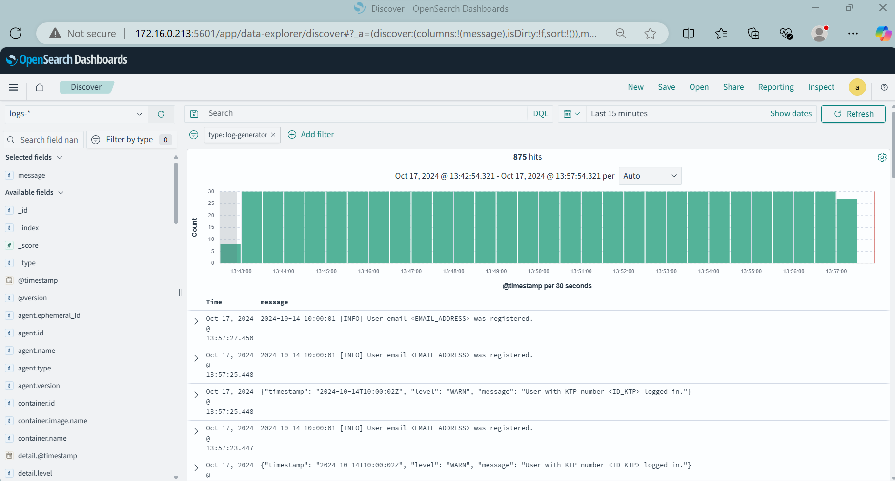
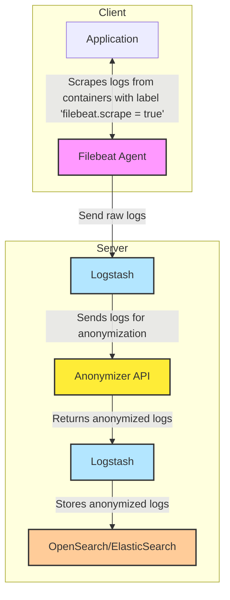

# Logging Stack

This repository provides a complete logging stack for collecting, storing, and visualizing logs.

- [OpenSearch](opensearch/): Includes configurations for both server-side (OpenSearch and Logstash) and client-side (Filebeat).
  - [Server](opensearch/server/): OpenSearch and Logstash setup for standalone or clustered environments.
  - [Client](opensearch/client/): Agents configuration for sending logs to the Logstash server.

> [!NOTE]
> 
> If you want to install the server and client on separate machines, visit each respective directory for instructions.

## Prerequisites

Ensure you have the following are prepared on your system:

- Install [Git](https://git-scm.com/downloads) - for version control and cloning the repository.
- Install [Rancher Desktop](https://rancherdesktop.io/) or [Docker](https://docs.docker.com/engine/install/) - for containerizing and running the application locally.

## Local Installation

To install the entire logging stack on your local machine, run the following:

```bash
git clone https://github.com/GDP-ADMIN/codehub
cd codehub/logging-stack/
./try-localhost.sh opensearch
```

> [!IMPORTANT]
>
> - This script is only supported on Linux systems (bash).

After installation, access the OpenSearch dashboard in your browser at: [Localhost OpenSearch Dashboard](http://localhost:5601/app/data-explorer/discover#?_a=(discover:(columns:!(message,type),isDirty:!f,sort:!()),metadata:(indexPattern:f3827230-8c41-11ef-a956-ef74ddfb0248,view:discover))&_g=(filters:!(),refreshInterval:(pause:!t,value:0),time:(from:now-15m,to:now))&_q=(filters:!(('$state':(store:appState),meta:(alias:!n,disabled:!f,index:f3827230-8c41-11ef-a956-ef74ddfb0248,key:type,negate:!f,params:(query:log-generator),type:phrase),query:(match_phrase:(type:log-generator)))),query:(language:kuery,query:'')))

<p align="center">
  </img>
</p>

> [!NOTE]
> 
> - Use the credentials from the `.env` file to log in (username: `admin`, default password: `SamaJugaTerbaik120`).

#### Destruction

To completely remove the logging stack that was installed, run the following command to stop and remove all Docker services:

```bash
./down.sh
```

## Application Requirements

Once the logging stack is installed, your application must meet the following requirements to forward logs to OpenSearch:

- The application must run in a container (using [Docker](https://docs.docker.com/engine/install/)).
  - It should include a [label](https://docs.docker.com/engine/manage-resources/labels/): `filebeat.scrape = true`
- The application should print logs to stdout (visible with the `docker logs` command).
- The log format can be any format. If it's JSON, Logstash will automatically parse it.

See the [sample-app](sample-app/) for an example that follows these requirements.

## How it Works


