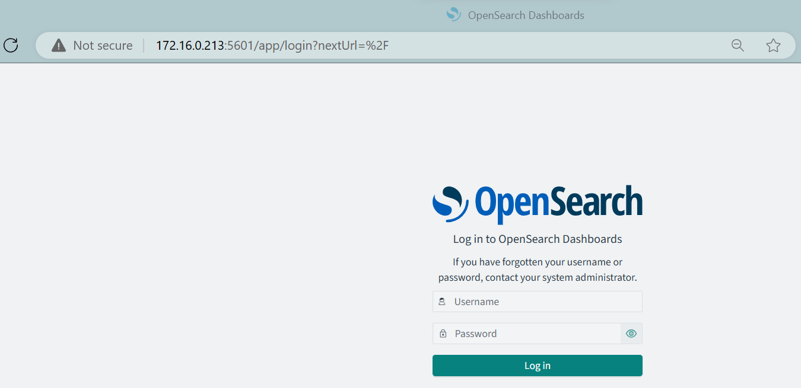

## Standalone OpenSearch Server Setup

This directory contains the setup for the OpenSearch server and Logstash. This server setup is responsible for receiving, indexing, and storing logs, and providing a UI through OpenSearch Dashboards.

### Prerequisites

Make sure you have the following installed on your system:

- [Git](https://git-scm.com/downloads)
- [Rancher Desktop](https://rancherdesktop.io/) or [Docker](https://docs.docker.com/engine/install/)
- Successfully installed [**anonymizer**](../../../anonymizer/README.md#prerequisites) service
- Copy the `.env.example` file to `.env` and update the values **if needed** (e.g., passwords, versions).

### Quick Start

Run the following simple command:

```bash
git clone -b one-line https://github.com/GDP-ADMIN/gdplabs-exploration
cd logging-stack/opensearch/server/standalone-cluster/
./install.sh
```

> [!IMPORTANT]
>
> - This script is only supported on Linux systems (bash).

After installation, access the OpenSearch dashboard in your browser at: http://OPENSEARCH_SERVER_IP_ADDRESS:5601

<p align="center">
  </img>
</p>

> [!NOTE]
> 
> - Use the credentials from the `.env` file to log in (username: `admin`, default password: `SamaJugaTerbaik120`).
